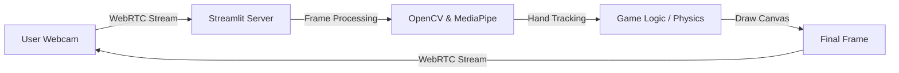

# 🎨 FunDraw_ChemLab: AI Virtual Painter & Chemistry Lab

[](https://streamlit.io/)
[](https://opencv.org/)
[](https://developers.google.com/mediapipe)
[](https://www.python.org/)
[](https://fundraw-chemlab.onrender.com/)
[](https://fundraw-chemlab.onrender.com/)

**FunDraw_ChemLab** is a futuristic, touchless interactive application that turns your webcam into a canvas and a science lab. Using advanced Computer Vision and Hand Tracking, it allows users to draw in mid-air and simulate chemical reactions without touching a keyboard or mouse.

---

## 🌟 Key Features

### 🎨 AI Virtual Painter
- **Air Canvas**: Draw on the screen simply by moving your index finger.
- **Gesture Selection**: Use two fingers (Index + Middle) to select colors or tools from the virtual toolbar.
- **Dynamic Brush Sizes**: Adjust stroke thickness on the fly.
- **Eraser Mode**: Intuitive erasing of mistakes.

### 🧪 Virtual Chemistry Lab
- **Interactive Elements**: Select chemicals like Sodium, Water, Acid, and Base.
- **Drag & Drop**: "Pinch" your fingers to pick up a chemical and drop it into a beaker.
- **Real-time Simulation**: Watch reactions happen (e.g., color changes, smoke, explosions) based on chemical properties.

### 💻 Modern UI/UX
- **Glassmorphism Design**: Sleek, semi-transparent dark-mode interface.
- **Dual Support**: Run it as a desktop app (OpenCV) or a web app (Streamlit).
- **Responsive Controls**: Sidebar controls for ease of use in web mode.

---

## 🏗️ System Architecture

This application bridges the gap between **Real-time Computer Vision** and **Modern Web Technologies**.

### High-Level Flow


### Tech Stack Breakdown
1.  **Frontend (Streamlit & WebRTC)**
    - Uses `streamlit-webrtc` to establish a low-latency video stream directly between the user's browser and the Python server.
    - Handles UI events (buttons, sliders) and sends commands (clear, save, mode switch) via a thread-safe **Command Queue**.

2.  **Core Processing (OpenCV & Mediapipe)**
    - **Hand Tracking**: Google's MediaPipe Hands model detects 21 landmarks on each hand in real-time.
    - **Gesture Engine**: Custom logic interprets specific landmark configurations (e.g., Index Up = Draw, Two Fingers = Select).
    - **Graphics**: OpenCV draws lines, UI elements, and glassmorphic overlays onto the frame.

3.  **Chemistry Engine**
    - Simulates physics for pouring chemicals.
    - Detects interactions (e.g., `Water + Acid = Heat`, `Base + Acid = Salt`).

---

## 🚀 Quick Start

### Prerequisites
- Python 3.8+
- A webcam

### Installation

1.  **Clone the Repository**
    ```bash
    git clone https://github.com/YOUR_USERNAME/FunDraw_ChemLab.git
    cd FunDraw_ChemLab
    ```

2.  **Install Dependencies**
    ```bash
    pip install -r requirements.txt
    ```

### Usage

**Option 1: Web App (Recommended)**
Run the application in your browser with a modern UI.
Currently not functioning due to Hardware Requirements( Need good h/w in Deployment site). For now Try Locally " **Native App Option **"
```bash
streamlit run app.py
```

**Option 2: Native App (Performance Mode)**
Run the application directly with OpenCV windows.
```bash
python play.py
```

---

## 🎮 Controls Guide

| Action | Gesture / Input | Description |
| :--- | :--- | :--- |
| **Draw** | ☝️ **Index Finger Up** | Move your hand to draw on the canvas. |
| **Select Tool** | ✌️ **Index + Middle Up** | Hover over colors/chemicals to select them. |
| **Drag Item** | 👌 **Pinch (Thumb + Index)** | Grab a chemical and drag it to a beaker. |
| **Clear Canvas** | 🗑️ **Button / 'C' Key** | Wipes the screen clean. |
| **Save Art** | 💾 **Button / 'S' Key** | Saves your masterpiece to the local disk. |

---

## 📦 Project Structure

```text
FunDraw_ChemLab/
├── app.py              # Main entry point for the Streamlit Web App
├── play.py             # Core Logic: Hand tracking, drawing, and chemistry engine
├── render.yaml         # Configuration for auto-deployment to Render
├── requirements.txt    # List of Python dependencies
├── saved_paintings/    # Directory where your art is temporarily saved
└── .gitignore          # Git exclusion rules
```

---

## ☁️ Deployment

This project is configured for **1-Click Deployment** on [Render](https://render.com).

1.  Push this code to a **GitHub Repository**.
2.  Log in to Render and create a **New Web Service**.
3.  Connect your repository.
4.  Render will automatically detect `render.yaml` and configure the build.

---

## 🤝 Future Enhancements
- [ ] **AI-Generated Art**: Integrate Stable Diffusion to turn sketches into realistic art.
- [ ] **Multi-Hand Support**: Collaborative drawing with two hands.
- [ ] **3D Molecules**: Visualize chemical structures in 3D space.

---

**Built with ❤️ using MediaPipe & OpenCV**

